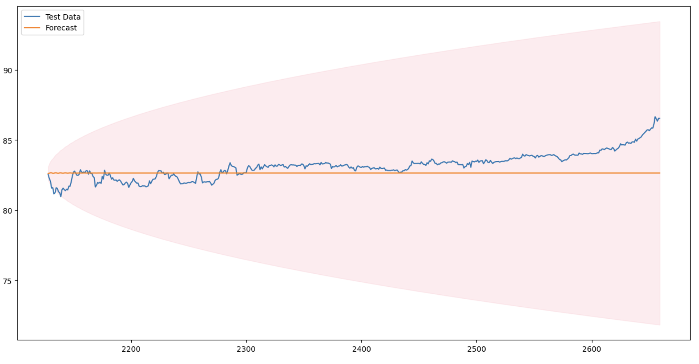
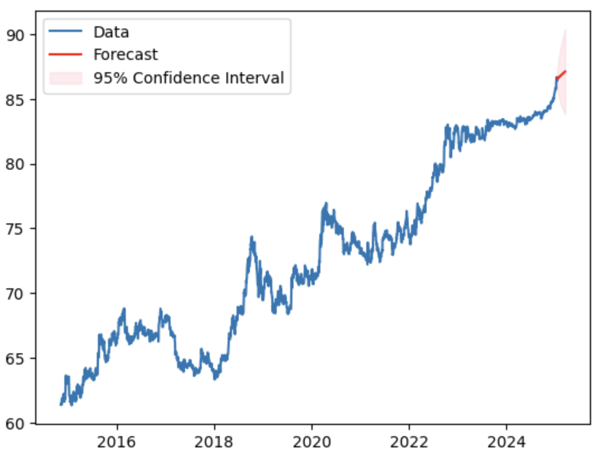
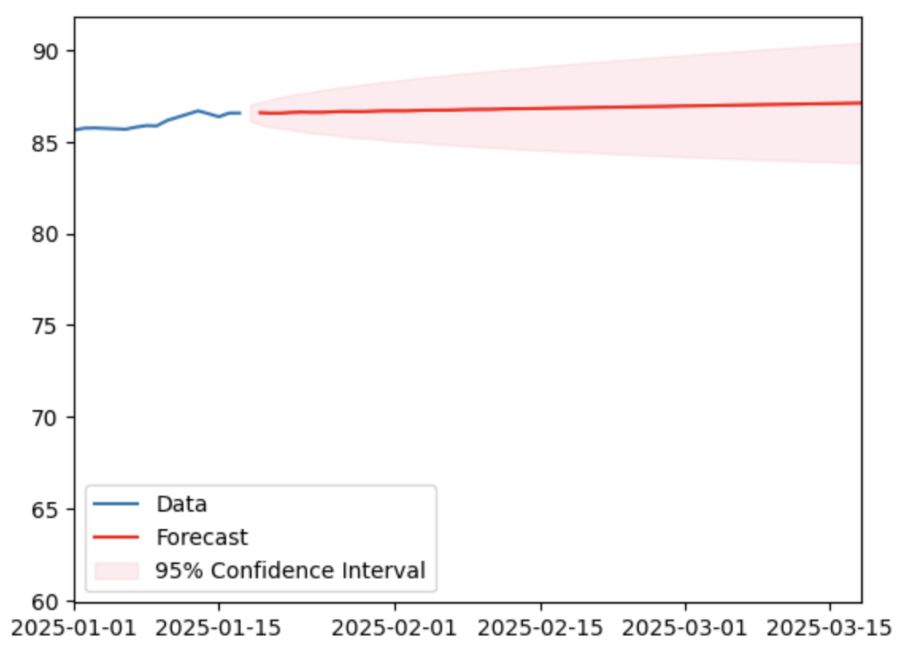

# Forecasting USD to INR Exchange Rates Using Time Series Analysis

## Overview

As an international student in the U.S., forecasting the exchange rate of USD to INR is both a practical and insightful problem to address. This project utilizes time series analysis techniques to predict the value of INR against USD over time.

## Project Objective

The goal of this project is to:
1. Predict the closing exchange rate of USD in terms of INR using historical data.
2. Analyze and visualize the predictions, confidence intervals, and their accuracy.
3. Explore the limitations of ARIMA and experiment with SARIMAX for improved predictions.

---

## Methodology

### Data Collection
- Data was collected using the **AlphaVantage API**, which provides historical foreign exchange data for the past 20 years.
- Focused on the closing exchange rates to ensure consistency and relevance for prediction.

### Statistical Analysis and Preprocessing
1. **Stationarity Check**:
   - Used the Augmented Dickey-Fuller (ADF) test to verify if the time series is stationary.
   - **Null Hypothesis**: The series is non-stationary.
   - **Results**: The series was non-stationary (p-value > 0.05), necessitating differencing.

2. **Differencing**:
   - Applied differencing to make the series stationary. 
   - First difference reduced trends, and second differencing showed strong correlations, leading to a differencing order (`d`) of 1.

3. **Correlation Analysis**:
   - **Autocorrelation Function (ACF)**:
     - Analyzed patterns in moving averages to determine `q = 2`.
   - **Partial Autocorrelation Function (PACF)**:
     - Evaluated direct relationships to determine `p = 2`.

### Model Selection and Implementation
- **ARIMA**:
  - The model was built with parameters ARIMA(2, 1, 2).
  - Predicted exchange rates for the test dataset.
  - Included confidence intervals to evaluate prediction reliability.

- **auto_arima and SARIMAX**:
  - Leveraged the `auto_arima` function, which internally uses SARIMAX for greater flexibility, including handling seasonality.

### Forecasting
- Predicted exchange rates for the next 60 days.
- Visualized results to compare forecasted values, actual values, and confidence intervals.

---

## Results and Insights

1. **Prediction Accuracy**:
   - While ARIMA provided a decent baseline, its accuracy was limited.
   - Predictions hovered around 82, whereas actual values were near 86.
   - Confidence intervals captured the actual values, indicating model reliability for rough estimates.
   

2. **Forecast Visualization**:
   
   - The red line in the plot represents forecasted values.
   
   - Confidence intervals provide an upper and lower bound, demonstrating the range of expected values.

3. **Limitations**:
   - ARIMA's precision needs improvement for high-stakes predictions.
   - Future work includes exploring more advanced models to enhance accuracy and reliability.

---

## Future Work

- Experiment with more complex models, such as LSTMs or Prophet, for advanced time series forecasting.
- Incorporate additional exogenous variables, like global economic indicators, to refine predictions.
- Compare SARIMAX and ARIMA results to assess the impact of seasonal components.

---

## Technologies Used

- **Python**: For data analysis and modeling.
- **Libraries**:
  - `pandas`: Data manipulation.
  - `statsmodels`: ARIMA and SARIMAX modeling.
  - `pmdarima`: auto_arima for model optimization.
  - `matplotlib`: Visualization.

